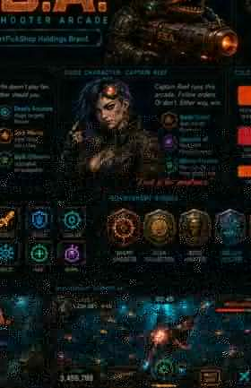

# F.S.A. — Fish Shooter Arcade

**SmartPickShop Holdings · Premium Table Engine v4**

F.S.A. is a standalone owned virtual arcade with **15 original fish-shooter tables** and **20 original slot-style mini games**. The fish experience now uses a dense cyber-aquatic cabinet HUD inspired by the interaction patterns of modern fish-table arcades while retaining original F.S.A. visuals, rules and telemetry.

## Live site

GitHub Pages deploys automatically from `main`:

`https://anastaysia94-sudo.github.io/fish-shooter-arcade/`

Founder Console test module:

`https://anastaysia94-sudo.github.io/fish-shooter-arcade/admin/`

## 15 premium fish tables

1. Reef Run
2. Dragon Depths
3. Pirate's Plunder
4. Atlantis Rising
5. Ice Tide
6. Lava Reef
7. Storm Seas
8. Jade Dragon
9. Neon Ocean
10. Ancient Ruins
11. Mecha Marine
12. Coral Chaos
13. Kraken's Lair
14. Treasure Trials
15. Boss Rush

Every title has its own event identity, boss, accent treatment, table theme and pacing. All fifteen use the Premium Table Engine rather than the original simple target-demo UI.

## Premium Table Engine v4

- Bronze Reef, Silver Current and Gold Abyss room tiers
- Cabinet-style top resource bar and bottom cannon cockpit
- Dense schools with procedurally rendered targets instead of emoji-only gameplay
- Visible target multipliers and elite-target HP bars
- Simulated shared-table player seats and AI co-shooters
- Boss countdown, boss HP, boss finishing-shot ownership and event banners
- Live missions, Ocean Radar, table activity feed and target info panel
- Combo chains and Fever mode
- Cannon shot-value +/- controls and persistent cannon upgrades
- Auto-fire, target lock and touch/mouse hold-to-fire
- Freeze, lightning, depth-bomb and capture-net powers
- Per-title special-event cadence
- Exact owned-game telemetry: `fsa.telemetry.v4`

## Android + low-data mode

The fish engine checks the browser Network Information API when available. `saveData`, `2g`, and `slow-2g` connections automatically use a lighter render path with fewer simultaneous targets, reduced glow/particles and slower continuous-fire timing. The core gameplay is Canvas/CSS/JavaScript so it does not require downloading a large sprite pack to begin playing.

The v4 service worker precaches only the lightweight application shell and premium engine files. Large artwork such as the Captain Reef hero image is runtime-cached after use instead of blocking PWA installation. Once the shell has loaded successfully, it can fall back to the cached application when connectivity is poor or unavailable.

## 20 slot-style mini games

Twenty original five-reel, three-row virtual-credit mini games remain available, from Ocean Fortune and Treasure Reels through Wild Pearls and Treasure Temple. They are entertainment-only simulations and do not provide deposits, withdrawals, cash prizes, or redemption.

## Founder Console

The `/admin/` module currently provides the F.S.A. control-plane prototype: Founder → Agent → User account workflows, agent credit ceilings, user creation, game access, cashier/moderator permission separation, suspensions, append-only virtual-credit ledger concepts, reversals, audit history and exports.

It is currently a browser-local prototype, **not yet the server-authenticated production authority**. Production conversion still requires authenticated server roles, database persistence, MFA and server-authoritative ledger enforcement.

## Architecture boundary

F.S.A. remains a separate product from EGM4000. The owned F.S.A. telemetry contract is designed so EGM4000 can consume exact gameplay events later through an explicit API boundary without merging the products. The Founder Console module is co-hosted here for the present F.S.A. prototype but is designed as a separable control plane.

## Safety / integrity

F.S.A. uses **virtual/non-cash credits only**. No real-money deposits, withdrawals, cash prizes, redemption, or regulated gambling operation is enabled by this release. Third-party services are not modified or bypassed, and proprietary third-party code, art, hidden payout logic or credentials are not copied.

## Validation

GitHub Actions verifies the 15-fish / 20-slot catalog, Premium Table Engine v4 files, `fsa.telemetry.v4`, all three room tiers, Fever/Radar/power systems, 2G/data-saver detection, PWA shell caching, Founder Console controls, and JavaScript syntax for both legacy and premium engines.
